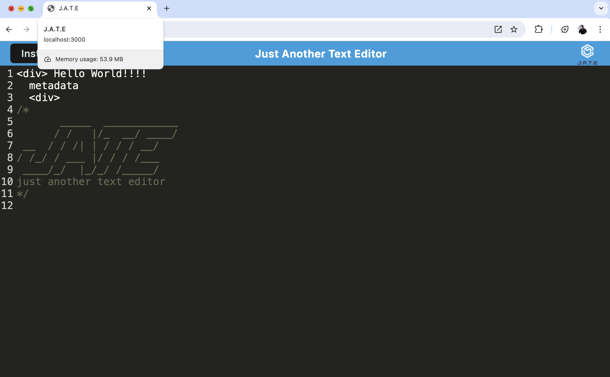

# Sunset Text Editor
  
 
  ## table of contents 
  *  [Description](#description)
  *  [Installation](#installation)
  *  [Usage](#usage)
  *  [Questions](#questions)
  *  [License](#license)
    
  
## Description
My motivation to create this project was to create a text editor that will runs as a PWA. I built this project to create a streamlined way to access a text editor. This application solves the problem of not having a text editor that works well as a PWA. .

## Deployed Site

I was not able to deploy this app because I ran into an issues with a dependency inside of a dependency inside of a package I used called "minimist". The project works at the local host.

## Installation

To install the project, pull the code from https://github.com/stefanfilm/sunsettexteditor and open it in a code editor. Run npm i to install the package json. Run npm start to use the application at local host 3000.

## Usage

Open the code editor and type in code. Organize the text by pressing enter to go to a new line and tab to make space.


    ```md
    
    ```


  ## License
  This project is licensed with the MIT license.
  

  ## Contributions
  Self. This project was made under the instruction of Mark Carlson in the UC Berkeley Software Development Bootcamp.

  ## Questions
  You can contact me at stefan.wanigatunga@gmail.com
  My GitHub Username is stefanfilm